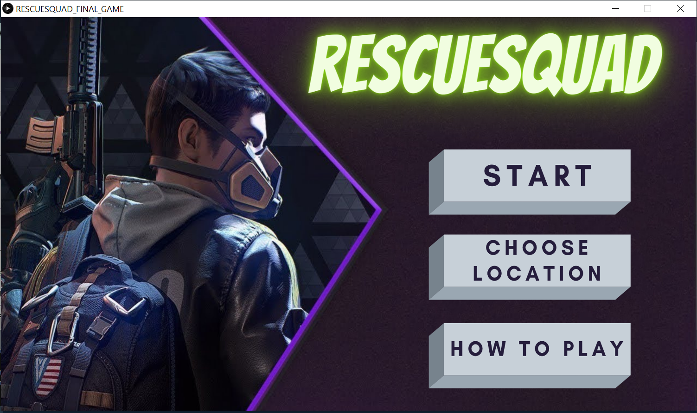
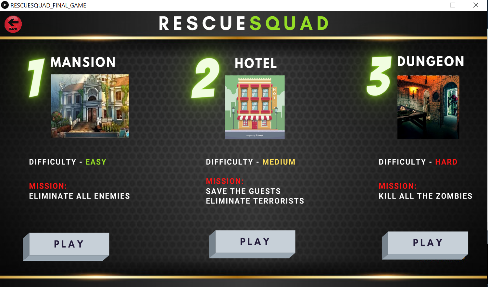
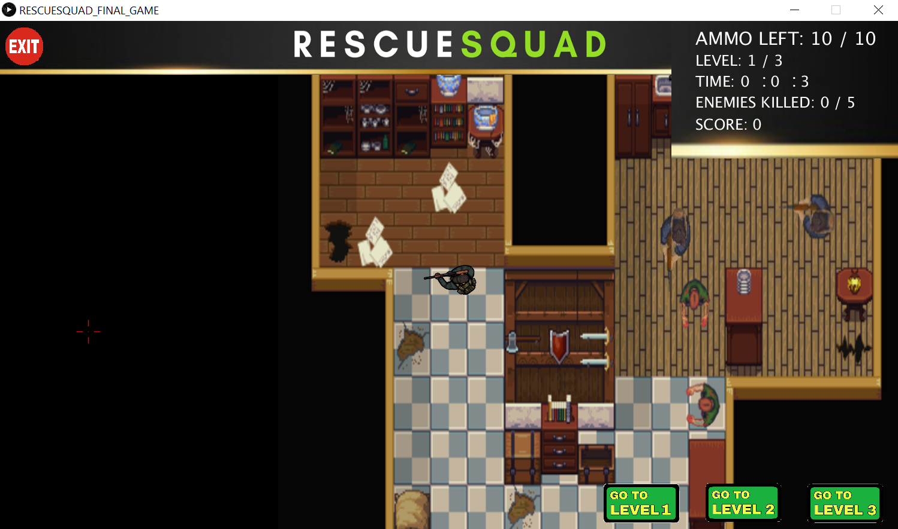
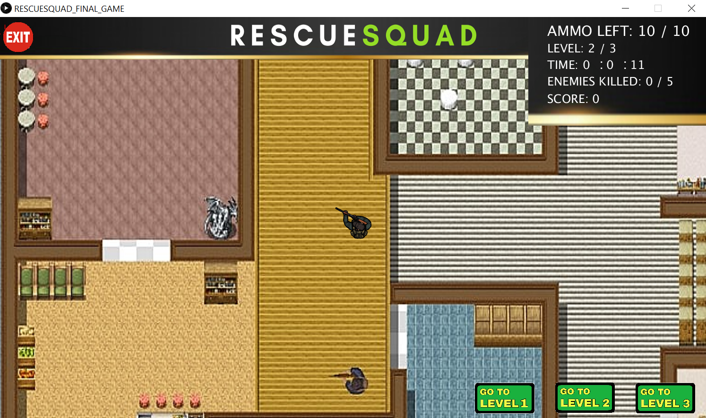
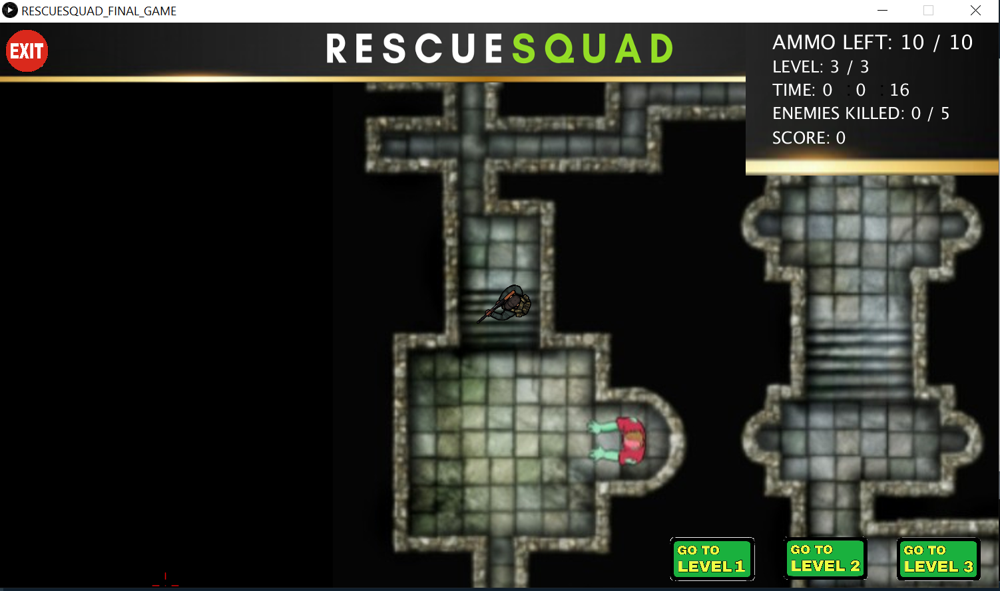
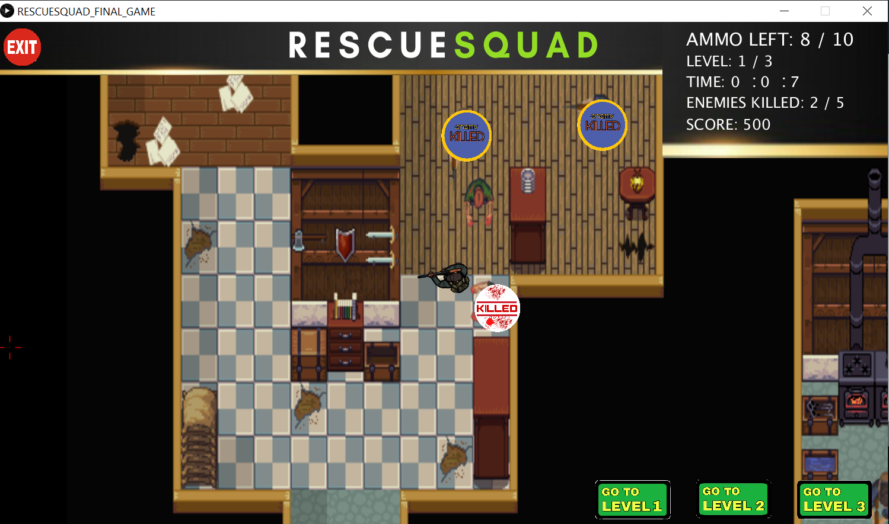
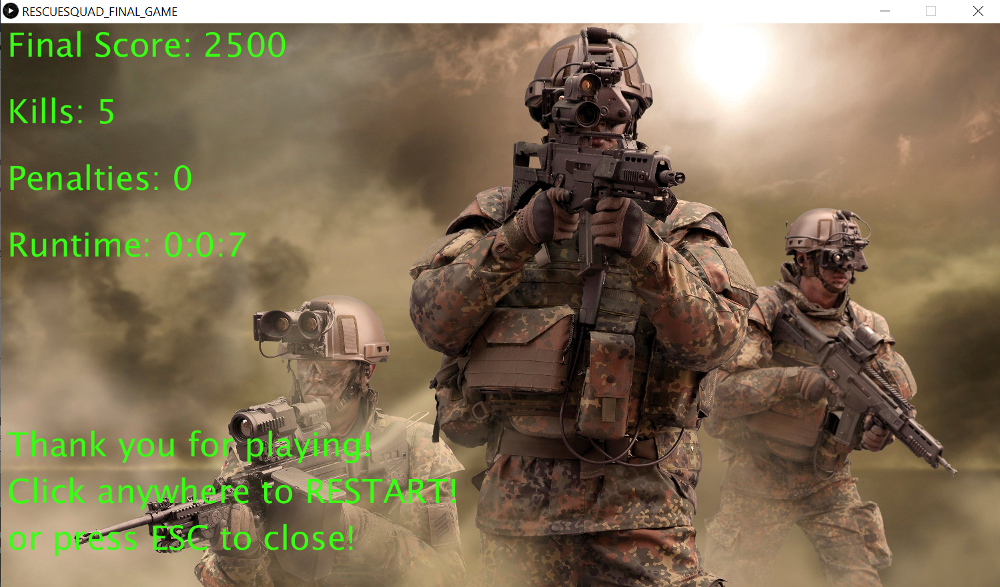
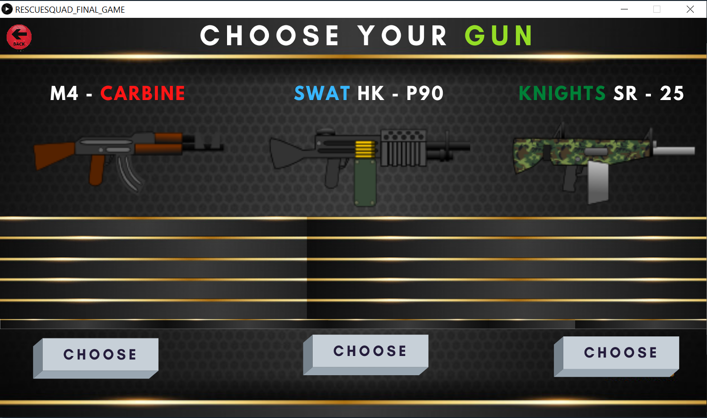

## RESCUESQUAD Game

### This is a 2D Top Down Retro Shooter Game, which was my computer science class's FINAL PROJECT.

Programming language used: __Python and Processing GUI__

__Game Features__
- 3 Levels - Mansion (Easy), Hotel (Medium), and Dungeon (Hard).
- The shooter sprite has ability to navigate using W, A, S, D keys, rotate using mouse, and shoot bullets on left mouse click.
- Detect enemy and hostage kills.
- Navigate game with several buttons i.e. exit, back, click menus, level change, etc.
- Score board updates in real-time and keeps track of bullets/ammo.

Here are some screenshots of the game:

1.  &emsp; 2. 

3.  &emsp; 4.  

5.  &emsp; 6. 

7.  &emsp; 8. 
